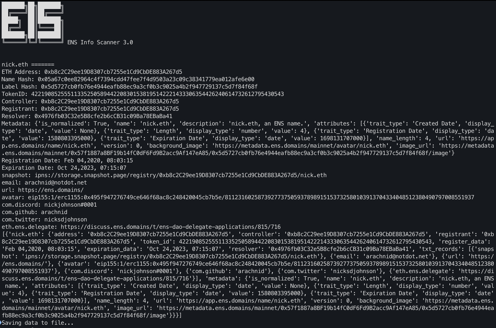

[](https://github.com/salaheldinaz/eis)
[](http://makeapullrequest.com)
[](https://github.com/salaheldinaz/eis3/actions/workflows/docker-image.yml)


<h1 align="center">ENS Info Scanner (EIS 3.0)</h1>

*<p align="center">Search for information about ens domain or eth address using ENS contracts in Ethereum chain, and ENS metadata api.</p>*

---

_Ethereum Name Service (ENS) is a distributed, extensible naming system based on the Ethereum blockchain._


### Prerequisite
- Python 3.7 or newer.
- Infura API key (free).  https://infura.io/

### Installation
```shell
pip install -r requirements.txt
```

---
### Usage

#### Single Domain Scan 
```shell
python main.py -d <domain.eth> -k <infura-api-key>
```
ex. `python main.py -d nick.eth -k 123456789abcdefg`

---
#### List of Domains Scan
```shell
python main.py -l <path-to-file> -k <infura-api-key>
```
ex. `python main.py -l list.txt -k 123456789abcdefg`

You can use:

`-s` to specify where to start in the list

`-e` to specify where to stop in the list

ex. `-s 100 -e 200` 

---

#### Ethereum Address Scan
```shell
python main.py -a <ethereum-address> -k <infura-api-key>
```
ex. `python main.py -a 0xb8c2c29ee19d8307cb7255e1cd9cbde883a267d5 -k 123456789abcdefg`

---

### Using Docker

##### Using the published image

https://hub.docker.com/repository/docker/salaheldinaz/eis3

```shell
docker run -it --rm -v `pwd`:/app/results/ salaheldinaz/eis3:latest -d nick.eth -k 123456789abcdefg
```
`pwd` This folder will be used to save the result.

---

##### Using a local docker image
1. Build
```shell
docker build -t "eis3:latest" . 
```

2. Run
```shell
docker run -it --rm -v `pwd`:/app/results/ eis3:latest -d nick.eth -k 123456789abcdefg
```
`pwd` This folder will be used to save the result.

---
### Output Example 



---

Authors

[](https://twitter.com/ginsberg5150)
     [](https://twitter.com/salaheldinaz)
